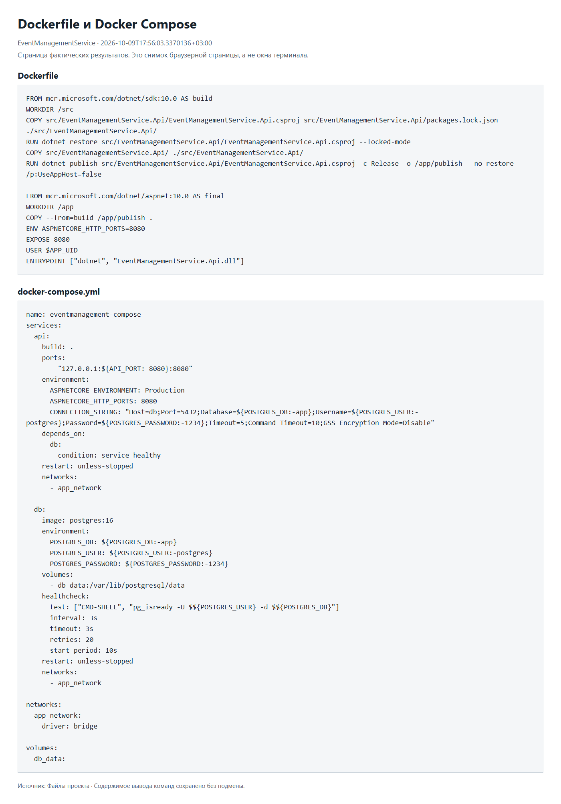
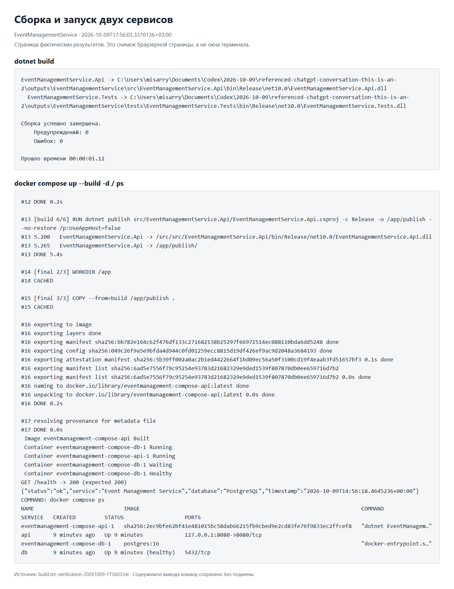
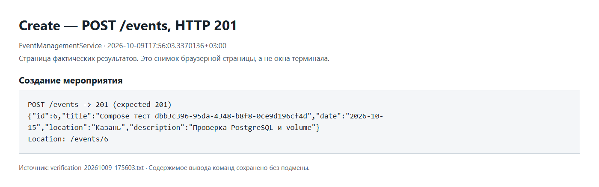
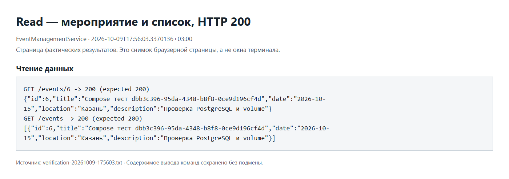
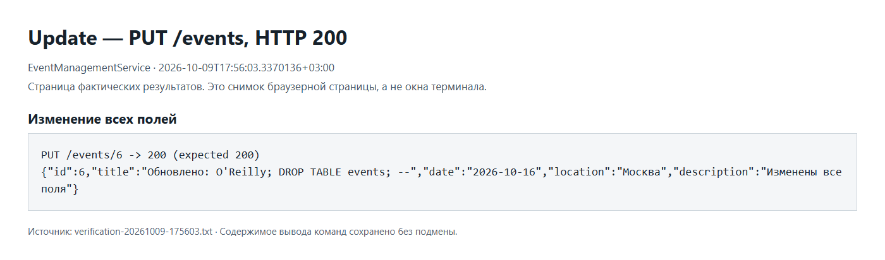
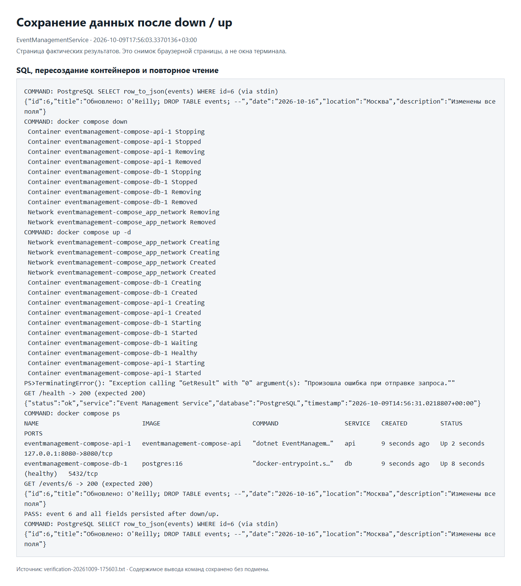
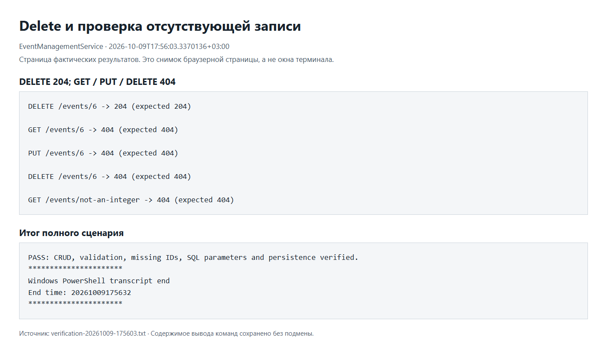
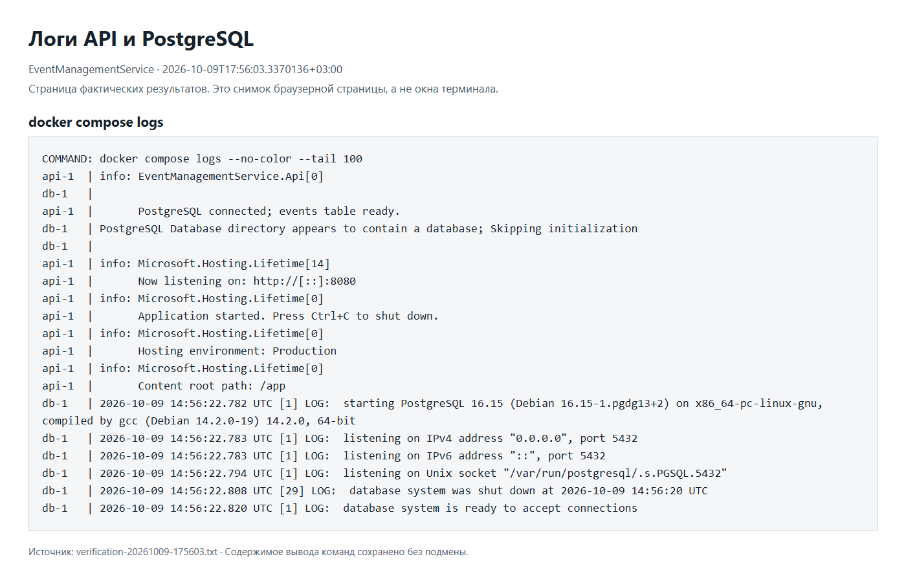
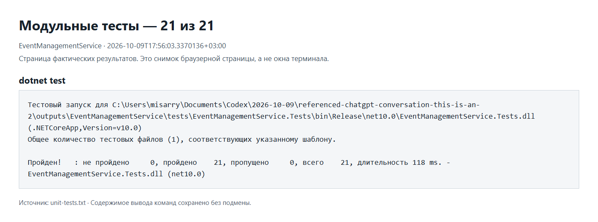

# EventManagementService — Compose

Контрольная точка по дисциплине «Введение в DevSecOps».
C# / ASP.NET Core .NET 10, PostgreSQL 16. Сервис хранит мероприятия:
название, дату, место и описание. Требования взяты из «Вставленный текст.txt» и «9. Compose.pptx».

## Запуск

Нужны Docker Desktop в режиме Linux containers и Docker Compose.
Распакуйте архив, откройте `EventManagementService.sln` в Visual Studio
с поддержкой .NET 10. Запуск выполняется из терминала в корне проекта:

```powershell
docker compose up --build -d
docker compose ps
curl.exe -i http://localhost:8080/health
```

Дождитесь HTTP 200 от `/health`. API: http://localhost:8080.
В решении только API и проект тестов. API запускается в Compose;
для локального F5 отдельно нужны PostgreSQL и переменная `CONNECTION_STRING`.

## CRUD

| Запрос | Результат |
|---|---|
| POST /events | 201, созданное мероприятие и Location |
| GET /events | 200, список |
| GET /events/{id} | 200 или 404 |
| PUT /events/{id} | 200 или 404, замена всех полей |
| DELETE /events/{id} | 204 или 404 |

`title` обязателен, до 200 символов; `date` — YYYY-MM-DD;
`location` обязателен, до 300 символов; `description` — до 2000 символов,
по умолчанию пустая строка. Неверный JSON или поля возвращают 400.
ID выдаёт PostgreSQL. SQL использует параметры.

Примеры для Windows PowerShell из корня проекта:

```powershell
curl.exe -i -H "Content-Type: application/json" --data-binary "@examples/create.json" http://localhost:8080/events
$id = 1 # замените на id из ответа POST
curl.exe -i http://localhost:8080/events
curl.exe -i "http://localhost:8080/events/$id"
curl.exe -i -X PUT -H "Content-Type: application/json" --data-binary "@examples/update.json" "http://localhost:8080/events/$id"

# Проверка сохранения до удаления мероприятия
docker compose down
docker compose up -d
# После готовности /health:
curl.exe -i "http://localhost:8080/events/$id"

curl.exe -i -X DELETE "http://localhost:8080/events/$id"
curl.exe -i "http://localhost:8080/events/$id" # 404
```

## Compose и защита

`api` собирается из Dockerfile на .NET 10; `db` использует `postgres:16`.
Оба сервиса находятся в сети `app_network`. Строка подключения приходит
через `environment`, адрес БД внутри сети — **db**, а не localhost.
`depends_on: service_healthy` ждёт успешного `pg_isready`.
`db_data` подключён к `/var/lib/postgresql/data` и сохраняет данные при удалении контейнеров.
Таблица создаётся при старте через `CREATE TABLE IF NOT EXISTS`.

Учебные настройки: база `app`, пользователь `postgres`, пароль `1234`, порт API `8080`.
Их можно изменить, скопировав `.env.example` в `.env`.
POSTGRES_* задают настройки при первом создании базы; пароль существующего volume
при редактировании `.env` сам не меняется.

На защите покажите POST → GET → PUT → down/up → GET того же id → DELETE → GET 404.
Объясните различие контейнера и volume: `down` сохраняет данные,
**`down -v` удаляет volume и данные**. Посмотрите состояние и логи:

```powershell
docker compose ps
docker compose logs --tail 100
docker compose restart api
docker compose stop
```

## Тесты

```powershell
dotnet restore EventManagementService.sln --locked-mode
dotnet test EventManagementService.sln -c Release
powershell -NoProfile -ExecutionPolicy Bypass -File scripts/Verify-Compose.ps1
```

21 модульный тест проверяет валидацию и JSON. Сценарий Compose проверяет
реальные CRUD-запросы, PostgreSQL, ошибки и сохранение всех полей после down/up.
Он временно перезапускает этот проект и удаляет свои тестовые записи.
Вывод сохраняется в `evidence/verification-*.txt`; успешный результат заканчивается `PASS`.

## Скриншоты этапов

Проверки действительно выполнены 9 октября 2026 года: сборка без ошибок,
21 тест пройден, CRUD и сохранение после down/up подтверждены.
Ниже — настоящие снимки браузерных страниц с фактическим выводом команд;
это не снимки окна терминала. Исходные журналы находятся в `evidence`. При старте API возможен повтор запроса
к /health после временного отказа соединения; итог сценария — PASS.

### 1. Dockerfile и Compose


### 2. Сборка и запуск api + db


### 3. Create


### 4. Read


### 5. Update


### 6. Сохранение после down/up


### 7. Delete и 404


### 8. Логи


### 9. Тесты


